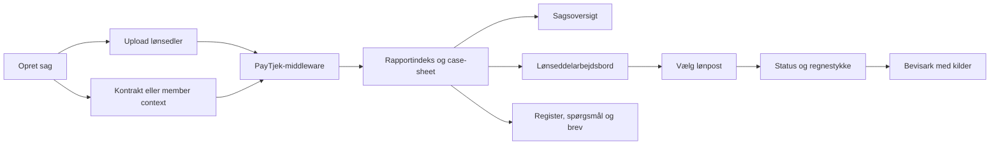

# PayTjek frontend — implementeringshandoff

Senest opdateret: 9. september 2026

## Kort fortalt

Frontend er nu formet som et internt arbejdsredskab for Dansk Metals lønkonsulenter. Den vigtigste
ændring er et kompakt lønseddelarbejdsbord, hvor konsulenten vælger en lønperiode, klikker på en
lønpost og straks ser middleware-rapportens status og regnestykke i en rude ved siden af. Det fulde
bevisark åbnes først, når konsulenten beder om dokumentationen.

Sagsoversigten og **Grundlag & kilder** er samtidig gjort væsentligt mere kompakte og følger det
samme visuelle princip som den godkendte mock-up: overblik først, detaljer ved klik.

Frontend beregner fortsat ikke løn. PayTjek-middleware er den autoritative kilde til beløb,
kontrolstatus, regnestykker, fund, spørgsmål og brevgrundlag.

## Projekt og Git

```text
Projekt: /Users/leifandersson/Projects/salary-sight-ui-codex
Branch:  codex/middleware-integration
HEAD:    e678dac docs: add project handoff
Remote:  https://github.com/antongandersson/salary-sight-ui.git
```

De seneste frontendændringer er ikke committet. Arbejdstræet indeholder både den aktuelle
rapportetape og tidligere middleware-/uploadændringer. Gennemgå derfor diffen og stage kun de
tilsigtede filer før commit.

Projektet er koblet til Lovable. Publiceret historik må ikke force-pushes, rebaseres, amend'es eller
squashes, hvis ændringen allerede er pushed. Almindelige nye commits kan synkroniseres tilbage til
Lovable.

## Bindende produktprincipper

1. PayTjek-middleware er den eneste autoritative kilde til lønresultatet.
2. Frontend må ikke genberegne, rette, supplere eller gætte et resultat.
3. Frontend må gerne formatere og organisere returnerede data, men ikke skabe nye faglige
   konklusioner.
4. Alle beløb, statusser, regnestykker, kildehenvisninger og fund skal kunne spores til API-output.
5. Et manglende felt skal vises som manglende. Det må ikke erstattes af en sandsynlig værdi.
6. Der må ikke indsættes hardcodede eksempelresultater i den rigtige datavej.
7. Konsulentens lokale arbejdsmarkeringer må ikke fremstilles som gemt i sagssystemet.
8. Demo-middleware og testdokumenter må ikke forveksles med et produktionsmiljø.

## Bruger- og dataflow



UI'et uploader dokumenterne, følger behandlingsstatus og præsenterer resultatet. Alle faglige
udfald i højre side af diagrammet kommer fra middleware.

## Hvad der er implementeret

### 1. Middleware-integration og upload

Den statiske eksempelrapport er fjernet fra den rigtige datavej. Frontend bruger demo-middleware
som standard og kan peges mod et andet miljø med `VITE_PAYTJEK_API_BASE_URL`.

Flowet kan:

- oprette en sag;
- gemme member context og eventuel fødselsdato på sagen;
- uploade flere lønsedler som batch;
- uploade kontrakten via middlewarets dedikerede kontrakt-endpoint;
- følge både lønseddelbatch og kontraktjob;
- vise middlewarets dokumentklassifikation;
- hente rapportindeks, sagsdetaljer, case-sheet og brevgrundlag;
- hente den valgte lønperiode on demand;
- vælge en præcis rapport med kombinationen `period + slip_key`;
- håndtere revisioner og erstattede lønsedler uden at slå dem sammen.

API-kaldene ligger i `src/lib/paytjek-api.ts`.

### 2. Rapportens seks arbejdsflader

#### Sagsoversigt

`ReportOverview.tsx` gengiver middlewarets case-sheet i en kompakt visning:

- tre adskilte nøgletal for afgjorte afvigelser, mulige krav og kontrolpunkter;
- højst fire dokumenterede fund på forsiden;
- højst fire typer næste materiale;
- klik på et dokumenteret fund åbner den præcise lønseddel og det præcise bevisark.

Den tidligere tidslinje, den lange forklaring og det ekstra grundlagspanel er fjernet. Begrundelsen
er, at sagsoversigten skal kunne skannes hurtigt og ikke konkurrere med selve lønseddelarbejdet.
De tre opgørelser lægges ikke sammen i frontend.

#### Lønsedler

`PayslipWorkspace.tsx` er det nye primære arbejdsrum. Layoutet er det samme for alle perioder:

1. Venstre: perioderail med statusfarve, revisioner og erstattede sedler.
2. Midten: kompakte lønposter fra den valgte rapport.
3. Højre: kontroller og middleware-regnestykke for den valgte lønpost.

Når en lønpost vælges:

- alle kontroller, som middleware har knyttet til posten, bliver tilgængelige;
- både `OK`, `MISMATCH`, `FORBEHOLD`, `NEEDS_INPUT`, `REFUSED` og `KONTROLPUNKT` understøttes;
- den mest alvorlige kontrol vælges først, så en afvigelse ikke skjules bag en tidligere OK-kontrol;
- kontrollernes indbyrdes API-rækkefølge bevares i vælgeren;
- højre rude viser kun status, titel og det returnerede regnestykke;
- **Åbn bevisark** viser forklaring, input, kilder, citater og øvrig dokumentation.

En ny `PayslipWorkspace` monteres, når `slip_key` ændres. Det nulstiller den lokale linjeudvælgelse
og sikrer samme starttilstand i alle lønperioder.

Lønpostens lille hjælpetekst viser kun API-felterne `quantity`, `rate` og `basis` formateret. Den
udregner ikke selv resultatet. Selve regnestykket i højre rude kommer fra
`check.computation.arithmetic` eller `check.kroner.arithmetic`.

#### Bevisark

`EvidenceSheet.tsx` åbner som en sideflade og viser den valgte autoritative kontrol:

- terminal/status;
- middlewareforklaring;
- middleware-regnestykke;
- hvert input og dets angivne kilde;
- citater og kildehenvisninger;
- manglende materiale;
- kontrol-id og lønseddelnøgle.

Bevisarket er bevidst et andet detaljeringsniveau end lønseddelarbejdsbordet. Det gør det muligt at
arbejde hurtigt på lønpostniveau uden at miste dokumentationen.

#### Register

`ReportRegister.tsx` viser alle lønsedler i en arbejdsliste med fund, mulige krav, inputbehov,
revisioner og erstattede sedler. Optællingerne kommer fra case-sheet. Registeret beregner ingen
beløb.

#### Spørgsmål til medlem

`MemberQuestions.tsx` grupperer `needs_input` efter `ask_target`. Den samme oplysning vises én gang,
selv om den påvirker flere perioder.

Afkrydsningerne er kun lokal UI-tilstand. De gemmes eller sendes ikke, fordi der ikke findes en
aftalt sagssystemkontrakt til handlingen.

#### Arbejdsgiverbrev

`EmployerLetter.tsx` viser det låste brevgrundlag fra `GET .../case-sheet/brev`. Frontend danner
ikke selv krav, summer eller brevtekst. Redigering, afsendelse og historik kræver et separat
arbejdslag og en API-kontrakt.

#### Grundlag & kilder

`SourceProof.tsx` er ændret fra et langt kortkatalog til en kompakt to-kolonnevisning:

- venstre kolonne viser de sagsoplysninger, rapporten er afgjort på;
- højre kolonne viser regelkilder, sagskontekst og de vigtigste dokumenter;
- resten af dokumenterne er foldet sammen;
- footer viser sag, rapportgeneration, dannelsestid og input-digest.

Alle viste værdier og kilder kommer fra case-sheet, sagsdetaljer eller rapportens provenance.

## Vigtige tekniske beslutninger

### Alle linjekontroller vises i konsulentarbejdsrummet

Rapporten kan markere kontroller med:

```ts
visibility?: "internal" | "user_facing"
```

`checksForUi(report)` bevarer den oprindelige visibility-politik til brugerrettede oversigter og
legacy-komponenter. Det nye lønseddelarbejdsbord bruger derimod `allReportChecks(report)` og
`checksForLine(report, line)`.

Det er en bevidst beslutning, fordi værktøjet er internt for lønkonsulenter, og fordi de skal kunne
åbne beregningen på eksempelvis ATP, AM-bidrag og andre OK-kontroller. Hvis kun `user_facing` blev
vist, ville flere almindelige lønposter ikke have en synlig kontrol.

`allReportChecks` deduplikerer `report.checks` og `report.refusals` efter `check_id`.
`checksForLine` kobler både via `check.line_index` og `line.checks[]` og bevarer rapportens
kontrolrækkefølge.

### Visuel prioritering er ikke en lønberegning

Statusrækkefølgen bruges kun til at vælge farve og den første synlige kontrol på en lønpost:

```text
MISMATCH → NEEDS_INPUT → FORBEHOLD → REFUSED → KONTROLPUNKT → OK
```

Det ændrer ikke middleware-resultatet og beregner ingen penge. Brugeren kan stadig vælge samtlige
kontroller på posten.

### Progressive disclosure

Mock-up'ens princip er fastholdt på tværs af skærmene:

- sagsoversigt: kun beslutningsrelevant overblik;
- lønpost: status og regnestykke;
- bevisark: fuld forklaring og kilder;
- grundlag: få vigtigste kilder først, resten foldet sammen.

Formålet er at reducere læsetid uden at fjerne sporbarhed.

## Centrale filer

| Fil | Ansvar |
| --- | --- |
| `src/routes/index.tsx` | Upload, polling, genåbning, lazy rapporthentning og fanenavigation |
| `src/lib/paytjek-api.ts` | Klient og typer til middleware-endpoints |
| `src/lib/report.ts` | Rapporttyper, statusmetadata og kontrol↔lønlinje-helpers |
| `src/lib/case-sheet.ts` | Typer for middlewarets case-sheet |
| `src/lib/report-index.ts` | Sortering og opslag med `period + slip_key` |
| `src/components/report/PayslipWorkspace.tsx` | Tre-panel arbejdsbord for perioder, lønposter og beregning |
| `src/components/report/PeriodRail.tsx` | Perioder, revisioner og case-sheet-status |
| `src/components/report/EvidenceSheet.tsx` | Fuld dokumentation for én kontrol |
| `src/components/report/ReportOverview.tsx` | Kompakt case-sheet-baseret sagsoversigt |
| `src/components/report/SourceProof.tsx` | Grundlag, regelkilder, dokumenter og provenance |
| `src/components/report/ReportRegister.tsx` | Register over alle rapporter i sagen |
| `src/components/report/MemberQuestions.tsx` | Grupperede inputbehov |
| `src/components/report/EmployerLetter.tsx` | Låst brevgrundlag fra middleware |
| `src/components/upload/UploadCase.tsx` | Uploadfelter og klientvalidering |
| `src/components/upload/ProcessingCase.tsx` | Behandlingsstatus og dokumentklassifikation |

`PayslipFacsimile.tsx`, `PayslipView.tsx` og `ReportChecks.tsx` findes fortsat, men bruges ikke af
det nye primære lønseddelarbejdsbord. Fjern dem først, når det er bekræftet, at ingen anden route
eller planlagt visning skal genbruge dem.

## Det skal næste person være opmærksom på

### 1. Kun transaktionslinjer vises som lønposter

Hvis rapporten har `kind: "transaction"`, viser arbejdsbordet disse linjer og udelader
`PARSE_DROPPED`. Balance-/saldo-linjer vises ikke i den kompakte liste endnu. For legacy-rapporter
uden `kind` bruges en fallback baseret på beløb, antal, sats eller tilknyttede kontroller.

Afklar om konsulenterne også skal kunne vælge saldi som ferie, fritvalg og pension direkte i samme
arbejdsbord.

### 2. Kontroller på rapportniveau mangler en særskilt indgang

Lønseddelarbejdsbordet gør alle kontroller på en lønpost tilgængelige, men kontroller uden
linjetilknytning har endnu ikke en særskilt række som eksempelvis **Hele lønsedlen**. De kan stadig
optræde via sagsoversigt og andre case-sheet-flader, men bør få en eksplicit indgang, hvis
konsulenten skal gennemgå alle rapportniveaukontroller periode for periode.

### 3. Den originale scrubbed PDF vises ikke

Lønposterne er HTML bygget af rapportens `lines`. Frontend har ikke et autoriseret PDF-/billedaktiv
fra middleware og må ikke gætte en intern filplacering. En rigtig dokumentvisning kræver et sikkert
middleware-endpoint eller en signeret aktiv-URL.

### 4. Case-sheet og den valgte rapport har hver sin provenance

Sagsoversigten bygger på case-sheet-generationen. **Grundlag & kilder** viser case-sheetets grundlag
men rapportprovenance for den aktuelt valgte lønperiode. Bevar denne forskel tydelig, hvis
proveniensvisningen udvides.

### 5. Arbejdsstatus er ikke persistent

Spørgsmålsafkrydsning, eventuelle fremtidige noter og brevredigering må ikke præsenteres som gemt,
før sagssystemet har et endpoint og en afklaret revisionsmodel.

### 6. Produktion er ikke afklaret

- Standard-URL'en peger på demo-middleware.
- Autentificering og rettighedsstyring er ikke implementeret i denne frontend.
- Sikker adgang til lønsedler og kontrakter er ikke afklaret.
- API-fejl kan stadig få en mere målrettet brugerpræsentation.
- Brug kun scrubbed testmateriale i demo-miljøet.

### 7. Arbejdstræet er beskidt

Der er ikke lavet commit eller push af den aktuelle etape. Undgå at overskrive eller nulstille
ændringerne. Kør `git diff` og lav et normalt nyt commit, når scope er godkendt.

## Verifikation

Kørt på den aktuelle arbejdskopi 9. september 2026:

- `bunx tsc --noEmit` — bestået.
- `bun test` — 9 tests bestået.
- `bun run build` — bestået.
- `bun run lint` — 0 fejl; 6 eksisterende Fast Refresh-advarsler i generiske shadcn UI-filer.
- `git diff --check` — bestået.

DM-C1 er visuelt gennemgået i browseren:

- kompakt sagsoversigt;
- lønseddelarbejdsbord i juni og maj 2026;
- valg mellem flere kontroller på samme lønpost;
- automatisk prioritering af mismatch;
- ATP-lønpost med en intern OK-kontrol og middleware-regnestykke;
- fuldt bevisark;
- kompakt **Grundlag & kilder**.

Testene dækker visibility/legacy-adfærd, alle linjekontroller, kontrolrækkefølge, kontrol↔linje,
rapportindeks, dublerede perioder og præcis navigation med `period + slip_key`.

## Lokal start

```sh
cd /Users/leifandersson/Projects/salary-sight-ui-codex
git switch codex/middleware-integration
bun install
bun run dev -- --host 127.0.0.1 --port 5184
```

Hvis port 5184 er optaget, vælger Vite automatisk den næste ledige port. Ved dette handoff kører den
lokale server på:

```text
http://127.0.0.1:5185/
```

DM-C1 kan åbnes med:

```text
http://127.0.0.1:5185/?case_id=0cb6cd5c-9df4-4eef-a06b-2c8322adb949&period=2026-06
```

Den kørende proces er kun en lokal udviklingsserver og overlever ikke nødvendigvis lukning eller
genstart af Codex/terminalsessionen.

## Anbefalet næste rækkefølge

1. Brugertest lønseddelarbejdsbordet med 2–3 lønkonsulenter: kan de finde en afvigelse, kontrollere
   regnestykket og åbne bevisarket uden forklaring?
2. Tilføj en kompakt indgang til kontroller på rapportniveau, fx **Hele lønsedlen**.
3. Afklar om balance-/saldolinjer skal kunne vælges sammen med transaktionslinjerne.
4. Aftal middlewarekontrakten for sikker visning af den scrubbed original-PDF.
5. Aftal sagssystemets kontrakt for spørgsmål, svar, noter, brevredigering og historik.
6. Tilføj komponenttests for faneskift, lønpostvalg, kontrollervalg, bevisark og periodeskift.
7. Før produktion: konfigurér produktions-API, autentificering, dokumentrettigheder og en eksplicit
   no-demo-fallback.

## Definition of done for næste UI-etape

En ændring er først færdig, når:

- den virker på mindst to forskellige lønperioder;
- alle viste faglige oplysninger kan spores til middleware-output;
- frontend ikke foretager nye lønberegninger;
- både OK og afvigende kontroller kan åbnes fra lønposten;
- bevisarket stadig viser kilder og input;
- typekontrol, tests, lint og build er kørt;
- den er visuelt kontrolleret med DM-C1;
- handoffet er opdateret, hvis dataflow eller produktgrænser ændres.
