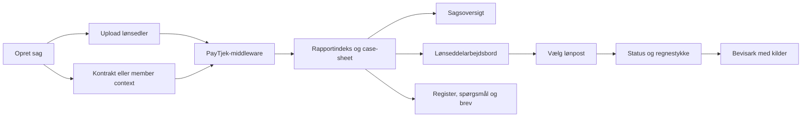

# PayTjek frontend — implementeringshandoff

Senest opdateret: 16. september 2026 (tidligere sessions-handoffs bevaret nedenfor).

## Godkendt roligere lønseddelarbejdsbord — 16. september 2026

Implementeret lokalt på `codex/calmer-payslips` i worktree
`.claude/worktrees/understand-repo-d73dbf`, fra commit `877a72f`.

- Det godkendte mock er omsat til én lønpostliste; den dobbelte "Kræver handling"-liste er fjernet.
- Perioderailen viser perioder og revisionsidentitet uden statusprikker, fund-tal og farveforklaring.
- Den valgte kontrol, middleware-beløbet og middleware-regnestykket står først i højre panel.
- Andre kontroller er foldet sammen. Alle terminaler og interne kontroller er fortsat tilgængelige.
- Saldi og kontroller for hele lønsedlen har hver sin foldbare indgang. Udeladte parserlinjer bevares.
- Søgning og "Kun afvigelser" filtrerer API-linjer via deres faktiske MISMATCH-kontroller.
- Den første lønpost med en MISMATCH vælges som udgangspunkt; det er kun navigation.
- Overskriftens eneste statusoptælling kommer fra `report.counters.by_terminal.MISMATCH`.
- Den lokale beløbssummering og formuleringen "øvrige i orden" er fjernet.
- Forventet og trykt vises uden gættede enheder. Manglende felter erstattes ikke af værdier.
- Lønposternes hjælpetekst navngiver antal, sats og grundlag uden at gætte satsens enhed eller regnestykke.
- Det komplette regnestykke kan foldes ud ordret; bevisarket og gennemgangskøen er bevaret.
- Den dobbelte periodevælger skjules på Lønsedler. Smalle skærme har en lokal periodevælger.
- På mobil ligger kontrollen under den rullebare postliste. Et bundfast panel dækkede filteret under browserkontrollen og er derfor fjernet.
- Middlewareprincippet er tilføjet `AGENTS.md`, så det følger arbejdet i kommende sessioner.

Verificeret: `bun test` (21 tests, 52 assertions), `tsc --noEmit`, `eslint .` (0 fejl,
9 eksisterende Fast Refresh-advarsler) og `vite build` består. Browserkontrol mod aktuel
Case 1 med 25 rapporter: juni og maj 2026, begge afvigelser, alle seks kontroller på
normaltimer inklusive intern REFUSED og OK, bevisark, søgning/tomt resultat, saldi,
hele-seddel-kontroller med afvigelsesfilter samt særskilt revisionsidentitet for oktober 2024.
Mobilbredde 390 × 844: periodevalg, filter, postvalg og bevisark afprøvet; ingen vandret
overløb eller browserfejl.

Brugeren har efter lokal gennemgang godkendt publicering på Railway. Produktionsmålet
er bekræftet via CLI: projekt `4b1e3194-a39c-458d-94ae-fcbd9dc6c364`, miljø
`ebad6c4f-c318-4d12-ad99-c3a484ecc93c`, service `34801b45-7ee2-44e2-bc42-d705005abd6c`
(`paytjek-frontend`). `NITRO_PRESET=node-server` og eksisterende login er sat på servicen;
det lokale build med dette preset består. Adresse:
https://paytjek-frontend-production.up.railway.app.

Releasekode: `315580e`. Railway-deployment `3302b3f4-a073-46a6-9221-d8e2ff131ca3`
(16. september 2026, oprettet 15:06:55 UTC) er verificeret som `SUCCESS`.
Upload er udført fra den nye worktree med eksplicit `--path-as-root`, projekt-, miljø-
og service-id. Produktionskontrol: HTTP 401 uden login, HTTP 200 med eksisterende login;
alle tre publicerede JS/CSS-filer har identiske SHA-256-fingeraftryk med det godkendte
lokale build. Den nye lønpostvisning er dermed verificeret i produktionsfilerne.
GitHub/Lovable synkroniseres ved fast-forward af `main`; udgivet historie omskrives ikke.

Demo-sager nulstilles løbende: hent aktuelle id'er med `GET /api/v1/cases`.
Gamle id'er længere nede i dette dokument kan være udløbet.

## Sessions-handoff 15. september 2026

### 1. Demo-miljøet er nulstillet IGEN — nye case-id'er

Alle id'er fra 14/9 er døde. Aktuel "Case 1" = `fc0c3f3d-b76c-41c3-a8c5-d3feef0e8e89`
(25 rapporter), "DM-C1" = `08e5b20c-13c5-411c-abe5-78e2394eba56`. Find altid aktuelle id'er med
`GET /api/v1/cases`. Case-sheetet meldte kortvarigt stale under formiddagens genopbygning — badgen
"Forældet generation" forsvandt af sig selv.

### 2. To små UI-fixes (commit `21e107b`) — begge verificeret mod Case 1, juni 2026

- **Perioderail-overlap fixet**: `truncate` på perioden, rail 136→164 px, "rev."-badge uden ikon.
  Fund-tal og badges kunne før lægge sig oven i "10/2024"-teksten ved smalle bredder/zoom.
- **"Kræver handling" forenklet**: striben viser kun MISMATCH som klikbare rækker;
  de (i juni) 15 NEEDS_INPUT samles i én linje "15 mangler oplysning — se Spørgsmål", der skifter
  til Spørgsmål-fanen (ny prop `onShowQuestions`). Baggrund: 16 rækker, hvoraf 12 var
  gentagelser af "kontrakten mangler"/"Mindstesats", druknede den ene afvigelse.
- Logik-tjek mod middleware: chips/stribe-tal matcher API'et 1:1
  (1 MISMATCH + 15 NEEDS_INPUT + 7 FORBEHOLD + 27 OK + 1 KONTROLPUNKT = 51 kontroller).
  De to oktober 2024-rapporter (rev./erstattet) er korrekt middleware-data, ikke en frontendfejl.

### 3. Statussprog-eksperiment — prøvet og FORKASTET (vigtig lære)

Problemet "fem statusser er svære at navigere" blev udforsket i et mock-canvas:
https://claude.ai/code/artifact/0f63f27f-f588-4fe0-a575-1f130bfb7cbc (tre spande; retning A
"sætninger", B "destinationer", C "fem, lærbare" — inkl. A og B som fulde arbejdsbord-mocks).
Brugeren valgte B (→ Brev / → Spørgsmål / → Gennemgang), fik den implementeret — og forkastede
den samme dag efter at have set den i den rigtige app: "ALT for uoverskueligt, der sker alt for
meget". Alt er revertet; gældende statussprog er det oprindelige. LÆRE: forbedringer i
Lønsedler-fladen skal FJERNE støj, ikke tilføje nye begreber/chips — et mock med én afvigelse
kan se roligt ud, men chips i fire lag støjer i den tætte, rigtige flade. Retning C-light
(kun omdøbning af rå ord som REFUSED, ingen nye elementer) står åben, ikke besluttet.

### 3b. Trin-tidslinjen er FJERNET fra sagsoversigten (senere samme dag)

Brugeren bad om at få Trin-tidslinjen (step_timing-sektionen fra 14/9) helt ud af UI'et —
`StepTimingSection` er slettet fra `ReportOverview.tsx`. Typen `CaseSheetStepTiming` og feltet
`step_timing` i `case-sheet.ts` er bevaret (de dokumenterer API'et). Dermed er hele
datakompletheds-etapen fra 14/9 nu rullet tilbage. OBS: demo-id'erne blev nulstillet endnu en
gang i løbet af dagen — stol aldrig på id'er i dette dokument, brug `GET /api/v1/cases`.

### 4. Git og deploy 15/9

`main` og `arbejde` er fast-forwardet til dagens commits og pushet (Lovable-sync via main).
Railway-deploy kørt fra repo-roden efter **eksplicit** `railway link --project
4b1e3194-a39c-458d-94ae-fcbd9dc6c364 --service paytjek-frontend --environment production` —
CLI'en stod (igen) linket til `raia-prod`; tjek altid `railway status` først.

### Praktisk 15/9

`.claude/launch.json` har nu `autoPort: true` — kører en anden session allerede på 5199, får
den næste server automatisk en fri port. Genåbn Case 1:
`/?case_id=fc0c3f3d-b76c-41c3-a8c5-d3feef0e8e89&period=2026-06`. Verifikation ved dette handoff:
`bunx tsc --noEmit`, `bun test` (18 tests), `bun run lint` (0 fejl, 9 kendte
Fast Refresh-advarsler), `bun run build` — alle bestået.

## Sessions-handoff 14. september 2026

Alt arbejde ligger på branchen **`arbejde`** (bygget oven på `claude/understand-repo-04223d`),
og **`main` er fast-forwardet til samme commit (`72eceab`)** — beslutningen om merge til main
(= Lovable-sync) er hermed truffet og udført. Deploy til Railway er kørt og verificeret.

### 1. Demo-miljøet er nulstillet — nye case-id'er

Alle case-id'er fra 9.–11. september er døde (404). DM-C1 hedder nu
`63758bbf-8f07-46f8-b6a0-ce8c41a682fc` (25 rapporter, juli 2024–juni 2026, IND23+IND25).
Find aktuelle id'er med `GET /api/v1/cases` (nu officielt dokumenteret). OBS: et dødt
case-id i URL'en falder stumt tilbage til upload-siden (fejlteksten står under folden i
formularen) — kendt UX-hul.

### 2. Middleware er opdateret (OpenAPI v0.2.0)

- **Nyt endpoint `POST /api/v1/cases/{id}/satsberegning`**: Dansk Metals satstrin-dokument
  (én PDF ≤ 15 MB, gemmes som `SATSBEREGNING`; re-upload erstatter og genkører audits).
- Batch-klassifikationen kan nu returnere `kind: "satsberegning"`.
- `GET /api/v1/cases` og `GET /api/v1/schema/report` er dokumenterede. Rapportformatet er
  uændret (`cycle11-raw-verification-report-v1`).
- Case-sheetet har fået mange nye afsnit (claims_ledger, forbehold, refused, coverage_checks,
  step_timing, by_class_terminal, substance_summary m.fl.) og fulde måneds-beregninger i
  `findings[].months[]`. En referencekørsel ligger i
  `/Users/leifandersson/Desktop/latest_DM_C/DM-C1/`.

### 3. Commits i denne session (alle på main)

- `173fb63` **Satstrin-upload**: nyt valgfrit uploadfelt; `DocumentKind` udvidet;
  kontrakt-specialtilfældet i `src/routes/index.tsx` generaliseret til `extraUploads`
  (dedikerede én-PDF-uploads polles ens).
- `6d1f44f` **Responsivt arbejdsbord**: trepanels-grid fra `lg:` (1024 px, før `xl:`);
  under 1024 px: vandret periode-chip-strip (`PeriodStrip` i `PeriodRail.tsx`) og
  Beregning som sticky bundpanel (maks 45vh). `grid-cols-1` fixer grid-blowout fra lange
  regnestykker; sektionen bruger `overflow-clip` (ikke `-hidden`), ellers dør sticky.
- `ba7ddd0` + `72eceab` **Datakomplethed vist — og rullet tilbage**: en etape der viste ALT
  nyt case-sheet-indhold blev afvist af brugeren ("det modsatte af en forbedring") og
  revertet. **Beholdt**: (a) Gennemgangen viser `forventet/trykt/lønlinje` pr. måned +
  "ældre end forældelsesfrist"; (b) **Trin-tidslinje** på sagsoversigten (step_timing med
  forfald → givet, forsinkelse, sats før/efter, rollup-beløb). VIGTIG LÆRE: nye
  middleware-felter renderes kun efter eksplicit accept pr. flade — foreslå én-to
  arbejdsunderstøttende visninger ad gangen.

### 4. Deploy 14/9

`railway up` fra repo-roden efter **eksplicit** `railway link --project
4b1e3194-a39c-458d-94ae-fcbd9dc6c364 --service paytjek-frontend --environment production`.
ADVARSEL: CLI'en kan være linket til et andet projekt (`raia-prod`) — tjek altid
`railway status` før `railway up`. Deploy verificeret: 401 uden login, 200 med
service-variablernes login, nye features bekræftet i det serverede JS-bundle.

### 5. Meldt til middleware-teamet 14/9

1. Genberegnings-stormen (stale-flag ryddes aldrig — handoff-punkt 7.1 nedenfor).
2. Parser-problemet med uafkodede rækker (7.2 nedenfor).
3. `step_timing` mangler en `sum_rule`: rollup-vinduerne overlapper (DM-C1: Σ rollups
   17.513,86 = fund-total 11.336,85 + 6.840,01 dobbelttalt overlap − 663,00 uden for
   vinduerne) — frontenden viser gerne middlewarens tekst, men skriver den ikke selv.
4. Brev-grundlagets `step_timing` mangler `rollup_kr`/`rollup_months` (case-sheetets har dem).

### 6. Forslag: gør Lønsedler-fanen mere intuitiv (IKKE godkendt endnu)

Brugerens vurdering: Sagsoversigt/Gennemgang/Spørgsmål/Brev er gode — **Lønsedler er den
klart svageste flade**. Foreslået etapeplan (hver etape lille, reversibel og 100 %
API-sporbar; implementér kun etaper brugeren har sagt ja til):

1. **"Kræver handling"-stribe** øverst i lønpostkolonnen: sedlens MISMATCH/NEEDS_INPUT-
   kontroller som klikbare rækker (vælger lønpost + kontrol direkte). Konsulenten ser
   straks det vigtige i stedet for at jage gennem 31 linjer.
2. **Støj-oprydning via `section`** (= det gamle åbne punkt 8.1): "Hele lønsedlen" viser kun
   `slip_level`; `coverage`/linjeløse `cross_slip` vises én gang under Grundlag & kilder;
   "N markeret" splittes i "X afvigelser · Y forbehold".
3. **Læsbart regnestykke**: typografisk formatering af `arithmetic`-blokken (ordret tekst,
   kun typografi: tal/resultatlinje fremhæves) + `expected`/`printed` som nøgletal over
   regnestykket, når de findes i `kroner`.
4. **Skimbar lønpostliste**: dæmp rene OK-linjer, statusfarve kun ved reelt udfald, tydelig
   Saldi-gruppering — så afvigelser springer i øjnene.
5. **Originalseddel-visning** (kræver middleware-endpoint, jf. etape 4 i den gamle plan) —
   den største gevinst på sigt: konsulenten genkender sedlen visuelt.
6. **Brugertest med 2–3 lønkonsulenter** før/efter etaperne.

### Praktisk (uændret fra 9.–11. sep, undtagen case-id)

Dev-server: `.claude/launch.json`-konfigurationen `paytjek-dev` (port 5199). Genåbn DM-C1:
`http://localhost:5199/?case_id=63758bbf-8f07-46f8-b6a0-ce8c41a682fc&period=2026-06`.
Verifikation ved dette handoff: `bunx tsc --noEmit`, `bun test` (15 tests), `bun run lint`
(0 fejl, 8 kendte Fast Refresh-advarsler), `bun run build` — alle bestået; deploy verificeret.

## Sessions-handoff 9.–11. september 2026

Alt arbejde ligger på branchen **`claude/understand-repo-04223d`**, pushet til
`https://github.com/antongandersson/salary-sight-ui.git`. Branchen indeholder hele
codex-etapen (fast-forward fra `codex/middleware-integration`, hvis ukommitterede
arbejdstræ blev committet som `b30cba4`) plus 12 nye commits (`935451f`…`a8d2bcb`).
Arbejdstræet er rent. Der er **ikke** oprettet PR til `main` — det er en åben beslutning
(merge til main synker til Lovable).

### 1. Datakomplethed — intet API-data skæres væk (`935451f`)

- Sagsoversigtens 4-styks-loft på fund/materiale fjernet; alle vises.
- Arbejdsbordet viser saldolinjer i egen **Saldi**-sektion og PARSE_DROPPED i foldbar liste
  (`partitionLines` i `PayslipWorkspace.tsx`).
- Kontroller uden linjetilknytning har indgangen **Hele lønsedlen** (`slipLevelChecks`).
- Alle regelkilder vises i **Grundlag & kilder** (før kun 3).

### 2. Gennemgangs-flow (`9c3078c`)

- Ny fane **Gennemgang**: alle måneds-referencer fra case-sheetets fund + mulige krav i én
  arbejdsliste (`src/lib/review-queue.ts`, `ReviewQueue.tsx`), grupperet pr. familie, med
  fremdriftsbjælke og lokal gennemgået-markering (IKKE persisteret — kun UI-tilstand).
- Bevisarket har kø-navigation: **Forrige / Gennemgået + næste / Næste** (`EvidenceQueueNav`).
- Sagsoversigten: **Mulige krav** er en klikbar liste som fundene; fund/krav har måneds-chips
  til hver berørt periode (ikke kun første måned).
- **Stale-fallback** (`readyReports`): er ALLE rapporter markeret stale, vises de alligevel
  med badgen **Forældet generation** (samme for stale case-sheet) i stedet for en uåbnelig sag.

### 3. UI-feedbackrunde (`9580b3a`, `675ace1`, `a125f52`)

- **Register-fanen er slettet** (redundant med Gennemgang + sagsoversigt).
- Kontrol-vælgeren i højre rude er en **liste med titel + statusprik** (afvigelser øverst,
  OK nederst) i stedet for anonyme status-chips.
- Lange middleware-regnestykker **foldes efter 8 linjer** med "Vis hele regnestykket".
- Vigtig lære: kontroller må IKKE optræde som rækker i lønpostlisten (blev prøvet og rullet
  tilbage på brugerens feedback). Lønpostlisten indeholder kun rigtige linjer plus én
  "Hele lønsedlen"-række, hvis undertekst opsummerer indholdet
  ("2 afvigelser med beløb · 10 øvrige kontroller", `slipSummary`).

### 4. Typografi og navigation (`7b98ef0`, `deefa65`)

- Alle tekststørrelser ét trin op (9→10 … 13→14 px) i rapport- og upload-komponenter.
- **Perioderail grupperet pr. år** med fold-ud (andre år foldes ved 8+ rapporter) og antal
  fund/krav som tal pr. periode og pr. år (`PeriodRail.tsx`).
- **Søgefilter i lønpostlisten** ("3 af 31 poster").

### 5. Nyt rapportformat september 2026 (`784743f`, `6bd7de5`)

Backend har opdateret rapportformatet (`cycle11-raw-verification-report-v1`):

- Nye check-felter: `superseded` (id'er på kontroller denne erstatter), `claim_axis`, `basis`,
  `note_source`/`title_source` samt faktabundterne `pension_basis_facts`, `trin_facts`,
  `rounding_facts`. Alle typer opdateret i `src/lib/report.ts`.
- `questions` er FJERNET fra rapporten (nu optional i typen; kun ubrugt legacy `SideRail`
  brugte det). Nyt topniveau: `case_sheet_pointers`, `provenance_facts`.
- Bevisarket viser faktabundterne som **"Faktagrundlag — Pensionsgrundlag/Løntrin/Afrunding"**
  (generisk nøgle/værdi-rendering, `FactValue`), **sammenfoldet som standard** — løntrins-
  kartoteket gjorde ellers arket ~13.000px højt. Plus "Denne kontrol erstatter: <id>"-note.

### 6. Railway-deploy med login (`b9927b8`, `a8d2bcb`)

- **URL: https://paytjek-frontend-production.up.railway.app** — projekt `paytjek-frontend`
  (id `4b1e3194-a39c-458d-94ae-fcbd9dc6c364`), konto antongandersson@gmail.com.
- Login er **HTTP Basic Auth** i `src/server.ts`, aktiv kun når `PAYTJEK_USER` /
  `PAYTJEK_PASSWORD` er sat (Railway-variabler; bruger `metal`, kodeord i Railway-dashboardet).
  Lokalt og på Lovable er gaten inaktiv. Skift kodeord:
  `railway variables --service paytjek-frontend --set "PAYTJEK_PASSWORD=…"` + redeploy.
- Build-detalje: repoets default nitro-preset er `cloudflare-module` (Lovable). Railway-servicen
  har variablen `NITRO_PRESET=node-server`, og `package.json` har fået
  `"start": "bun .output/server/index.mjs"`. OBS: Railways railpack-builder **ignorerede
  `railway.json`** — variablen + start-scriptet er det, der virker.
- Kun UI'et er bag login; API-kald går stadig direkte fra browseren til demo-middleware.

### 7. Backend-fund gjort i sessionen (skal meldes til middleware-teamet)

1. **Genberegnings-storm / stale-flag der aldrig ryddes:** GET på case-sheet/rapporter for en
   stale sag enqueuer en fuld re-render af alle sagens rapporter, men renderingen markerer
   aldrig sagen frisk igen (DM-C1 gik generation 36→67 på 14 min ved almindelige sideåbninger).
   Gentagne opslag oversvømmer arbejdskøen og gjorde 9/9 brugerens upload ekstremt langsom
   (jobs i QUEUED i minutter; reproduceret med curl uden om frontenden).
   Konsekvens i UI: badgen "Forældet generation" står permanent på ramte sager.
2. **Parser-problem lokaliseret:** de nyeste lønsedler i flere sager har uafkodede rækker
   (PARSE_DROPPED, `amount_unread`), bl.a. selve arbejdsgiverpensions-linjen — det udløser
   forbeholdet "Manglende bidrag — pension — uafkodede rækker på sedlen" fra maj 2026 og frem.
   Bekræftet som reelt backend-/dokumentkvalitetsproblem, ikke en frontendfejl.

### 8. Åbne beslutninger og næste skridt

1. **Støj-oprydning (foreslået, IKKE godkendt endnu):** brug checkens `section`-felt —
   "Hele lønsedlen" viser kun `slip_level`; `coverage`- og linjeløse `cross_slip`-kontroller
   flyttes til Grundlag & kilder som "Sagens dækning" (vist én gang i stedet for pr. seddel);
   "N markeret"-tælleren splittes i "X afvigelser · Y forbehold". `visibility`-feltet bruges
   bevidst IKKE til dette (det er medlem/konsulent-skel; arbejdsbordet viser alle kontroller —
   afklaret med brugeren, behold).
2. PR/merge til `main` (= Lovable-sync) er ikke besluttet.
3. Etape 4 fra planen: persistens af gennemgangs-markeringer (kræver sagssystem-endpoint),
   sikker visning af original-PDF, rigtig autentificering, samt backend-fejlmeldingerne ovenfor.
4. Brugertest med 2–3 lønkonsulenter anbefales stadig.

### Praktisk

- Dev-server: `.claude/launch.json` har konfigurationen `paytjek-dev` (port 5199);
  `bun run dev -- --host 127.0.0.1 --port 5199`. Genåbn en sag med
  `http://localhost:5199/?case_id=<id>&period=<YYYY-MM>`.
- Demo-API'et har `GET /api/v1/cases` (udokumenteret i frontendklienten) — praktisk til at
  finde case-id'er. Vær varsom med at genindlæse store stale sager (jf. punkt 7.1).
- Verifikation ved handoff: `bunx tsc --noEmit`, `bun test` (15 tests), `bun run lint`
  (0 fejl, 8 kendte Fast Refresh-advarsler), `bun run build` — alle bestået.

## Kort fortalt

Frontend er nu formet som et internt arbejdsredskab for Dansk Metals lønkonsulenter. Den vigtigste
ændring er et kompakt lønseddelarbejdsbord, hvor konsulenten vælger en lønperiode, klikker på en
lønpost og straks ser middleware-rapportens status og regnestykke i en rude ved siden af. Det fulde
bevisark åbnes først, når konsulenten beder om dokumentationen.

Sagsoversigten og **Grundlag & kilder** er samtidig gjort væsentligt mere kompakte og følger det
samme visuelle princip som den godkendte mock-up: overblik først, detaljer ved klik.

Frontend beregner fortsat ikke løn. PayTjek-middleware er den autoritative kilde til beløb,
kontrolstatus, regnestykker, fund, spørgsmål og brevgrundlag.

## Projekt og Git

```text
Projekt: /Users/leifandersson/Projects/salary-sight-ui-codex
Branch:  arbejde (pushet; main er fast-forwardet til samme commit 72eceab 14/9)
Remote:  https://github.com/antongandersson/salary-sight-ui.git
Deploy:  https://paytjek-frontend-production.up.railway.app (Basic Auth; deployet 14/9,
         se sessions-handoff 14/9 pkt. 4)
```

Arbejdstræet er rent, og alt er committet og pushet. Se sessions-handoffet øverst for
commit-oversigten. (Historisk note: codex-etapens ukommitterede arbejde blev reddet i
`b30cba4` den 9. september.)

Projektet er koblet til Lovable. Publiceret historik må ikke force-pushes, rebaseres, amend'es eller
squashes, hvis ændringen allerede er pushed. Almindelige nye commits kan synkroniseres tilbage til
Lovable.

## Bindende produktprincipper

1. PayTjek-middleware er den eneste autoritative kilde til lønresultatet.
2. Frontend må ikke genberegne, rette, supplere eller gætte et resultat.
3. Frontend må gerne formatere og organisere returnerede data, men ikke skabe nye faglige
   konklusioner.
4. Alle beløb, statusser, regnestykker, kildehenvisninger og fund skal kunne spores til API-output.
5. Et manglende felt skal vises som manglende. Det må ikke erstattes af en sandsynlig værdi.
6. Der må ikke indsættes hardcodede eksempelresultater i den rigtige datavej.
7. Konsulentens lokale arbejdsmarkeringer må ikke fremstilles som gemt i sagssystemet.
8. Demo-middleware og testdokumenter må ikke forveksles med et produktionsmiljø.

## Bruger- og dataflow



UI'et uploader dokumenterne, følger behandlingsstatus og præsenterer resultatet. Alle faglige
udfald i højre side af diagrammet kommer fra middleware.

## Hvad der er implementeret

### 1. Middleware-integration og upload

Den statiske eksempelrapport er fjernet fra den rigtige datavej. Frontend bruger demo-middleware
som standard og kan peges mod et andet miljø med `VITE_PAYTJEK_API_BASE_URL`.

Flowet kan:

- oprette en sag;
- gemme member context og eventuel fødselsdato på sagen;
- uploade flere lønsedler som batch;
- uploade kontrakten via middlewarets dedikerede kontrakt-endpoint;
- følge både lønseddelbatch og kontraktjob;
- vise middlewarets dokumentklassifikation;
- hente rapportindeks, sagsdetaljer, case-sheet og brevgrundlag;
- hente den valgte lønperiode on demand;
- vælge en præcis rapport med kombinationen `period + slip_key`;
- håndtere revisioner og erstattede lønsedler uden at slå dem sammen.

API-kaldene ligger i `src/lib/paytjek-api.ts`.

### 2. Rapportens seks arbejdsflader

#### Sagsoversigt

`ReportOverview.tsx` gengiver middlewarets case-sheet i en kompakt visning:

- tre adskilte nøgletal for afgjorte afvigelser, mulige krav og kontrolpunkter;
- højst fire dokumenterede fund på forsiden;
- højst fire typer næste materiale;
- klik på et dokumenteret fund åbner den præcise lønseddel og det præcise bevisark.

Den tidligere tidslinje, den lange forklaring og det ekstra grundlagspanel er fjernet. Begrundelsen
er, at sagsoversigten skal kunne skannes hurtigt og ikke konkurrere med selve lønseddelarbejdet.
De tre opgørelser lægges ikke sammen i frontend.

#### Lønsedler

`PayslipWorkspace.tsx` er det nye primære arbejdsrum. Layoutet er det samme for alle perioder:

1. Venstre: perioderail med statusfarve, revisioner og erstattede sedler.
2. Midten: kompakte lønposter fra den valgte rapport.
3. Højre: kontroller og middleware-regnestykke for den valgte lønpost.

Når en lønpost vælges:

- alle kontroller, som middleware har knyttet til posten, bliver tilgængelige;
- både `OK`, `MISMATCH`, `FORBEHOLD`, `NEEDS_INPUT`, `REFUSED` og `KONTROLPUNKT` understøttes;
- den mest alvorlige kontrol vælges først, så en afvigelse ikke skjules bag en tidligere OK-kontrol;
- kontrollernes indbyrdes API-rækkefølge bevares i vælgeren;
- højre rude viser kun status, titel og det returnerede regnestykke;
- **Åbn bevisark** viser forklaring, input, kilder, citater og øvrig dokumentation.

En ny `PayslipWorkspace` monteres, når `slip_key` ændres. Det nulstiller den lokale linjeudvælgelse
og sikrer samme starttilstand i alle lønperioder.

Lønpostens lille hjælpetekst viser kun API-felterne `quantity`, `rate` og `basis` formateret. Den
udregner ikke selv resultatet. Selve regnestykket i højre rude kommer fra
`check.computation.arithmetic` eller `check.kroner.arithmetic`.

#### Bevisark

`EvidenceSheet.tsx` åbner som en sideflade og viser den valgte autoritative kontrol:

- terminal/status;
- middlewareforklaring;
- middleware-regnestykke;
- hvert input og dets angivne kilde;
- citater og kildehenvisninger;
- manglende materiale;
- kontrol-id og lønseddelnøgle.

Bevisarket er bevidst et andet detaljeringsniveau end lønseddelarbejdsbordet. Det gør det muligt at
arbejde hurtigt på lønpostniveau uden at miste dokumentationen.

#### Register

`ReportRegister.tsx` viser alle lønsedler i en arbejdsliste med fund, mulige krav, inputbehov,
revisioner og erstattede sedler. Optællingerne kommer fra case-sheet. Registeret beregner ingen
beløb.

#### Spørgsmål til medlem

`MemberQuestions.tsx` grupperer `needs_input` efter `ask_target`. Den samme oplysning vises én gang,
selv om den påvirker flere perioder.

Afkrydsningerne er kun lokal UI-tilstand. De gemmes eller sendes ikke, fordi der ikke findes en
aftalt sagssystemkontrakt til handlingen.

#### Arbejdsgiverbrev

`EmployerLetter.tsx` viser det låste brevgrundlag fra `GET .../case-sheet/brev`. Frontend danner
ikke selv krav, summer eller brevtekst. Redigering, afsendelse og historik kræver et separat
arbejdslag og en API-kontrakt.

#### Grundlag & kilder

`SourceProof.tsx` er ændret fra et langt kortkatalog til en kompakt to-kolonnevisning:

- venstre kolonne viser de sagsoplysninger, rapporten er afgjort på;
- højre kolonne viser regelkilder, sagskontekst og de vigtigste dokumenter;
- resten af dokumenterne er foldet sammen;
- footer viser sag, rapportgeneration, dannelsestid og input-digest.

Alle viste værdier og kilder kommer fra case-sheet, sagsdetaljer eller rapportens provenance.

## Vigtige tekniske beslutninger

### Alle linjekontroller vises i konsulentarbejdsrummet

Rapporten kan markere kontroller med:

```ts
visibility?: "internal" | "user_facing"
```

`checksForUi(report)` bevarer den oprindelige visibility-politik til brugerrettede oversigter og
legacy-komponenter. Det nye lønseddelarbejdsbord bruger derimod `allReportChecks(report)` og
`checksForLine(report, line)`.

Det er en bevidst beslutning, fordi værktøjet er internt for lønkonsulenter, og fordi de skal kunne
åbne beregningen på eksempelvis ATP, AM-bidrag og andre OK-kontroller. Hvis kun `user_facing` blev
vist, ville flere almindelige lønposter ikke have en synlig kontrol.

`allReportChecks` deduplikerer `report.checks` og `report.refusals` efter `check_id`.
`checksForLine` kobler både via `check.line_index` og `line.checks[]` og bevarer rapportens
kontrolrækkefølge.

### Visuel prioritering er ikke en lønberegning

Statusrækkefølgen bruges kun til at vælge farve og den første synlige kontrol på en lønpost:

```text
MISMATCH → NEEDS_INPUT → FORBEHOLD → REFUSED → KONTROLPUNKT → OK
```

Det ændrer ikke middleware-resultatet og beregner ingen penge. Brugeren kan stadig vælge samtlige
kontroller på posten.

### Progressive disclosure

Mock-up'ens princip er fastholdt på tværs af skærmene:

- sagsoversigt: kun beslutningsrelevant overblik;
- lønpost: status og regnestykke;
- bevisark: fuld forklaring og kilder;
- grundlag: få vigtigste kilder først, resten foldet sammen.

Formålet er at reducere læsetid uden at fjerne sporbarhed.

## Centrale filer

| Fil                                          | Ansvar                                                             |
| -------------------------------------------- | ------------------------------------------------------------------ |
| `src/routes/index.tsx`                       | Upload, polling, genåbning, lazy rapporthentning og fanenavigation |
| `src/lib/paytjek-api.ts`                     | Klient og typer til middleware-endpoints                           |
| `src/lib/report.ts`                          | Rapporttyper, statusmetadata og kontrol↔lønlinje-helpers           |
| `src/lib/case-sheet.ts`                      | Typer for middlewarets case-sheet                                  |
| `src/lib/report-index.ts`                    | Sortering og opslag med `period + slip_key`                        |
| `src/components/report/PayslipWorkspace.tsx` | Tre-panel arbejdsbord for perioder, lønposter og beregning         |
| `src/components/report/PeriodRail.tsx`       | Perioder og særskilt revisionsidentitet                            |
| `src/components/report/EvidenceSheet.tsx`    | Fuld dokumentation for én kontrol                                  |
| `src/components/report/ReportOverview.tsx`   | Kompakt case-sheet-baseret sagsoversigt                            |
| `src/components/report/SourceProof.tsx`      | Grundlag, regelkilder, dokumenter og provenance                    |
| `src/components/report/ReportRegister.tsx`   | Register over alle rapporter i sagen                               |
| `src/components/report/MemberQuestions.tsx`  | Grupperede inputbehov                                              |
| `src/components/report/EmployerLetter.tsx`   | Låst brevgrundlag fra middleware                                   |
| `src/components/upload/UploadCase.tsx`       | Uploadfelter og klientvalidering                                   |
| `src/components/upload/ProcessingCase.tsx`   | Behandlingsstatus og dokumentklassifikation                        |

`PayslipFacsimile.tsx`, `PayslipView.tsx` og `ReportChecks.tsx` findes fortsat, men bruges ikke af
det nye primære lønseddelarbejdsbord. Fjern dem først, når det er bekræftet, at ingen anden route
eller planlagt visning skal genbruge dem.

## Det skal næste person være opmærksom på

### 1. Kun transaktionslinjer vises som lønposter

Hvis rapporten har `kind: "transaction"`, viser arbejdsbordet disse linjer og udelader
`PARSE_DROPPED`. Balance-/saldo-linjer vises ikke i den kompakte liste endnu. For legacy-rapporter
uden `kind` bruges en fallback baseret på beløb, antal, sats eller tilknyttede kontroller.

Afklar om konsulenterne også skal kunne vælge saldi som ferie, fritvalg og pension direkte i samme
arbejdsbord.

### 2. Kontroller på rapportniveau mangler en særskilt indgang

Lønseddelarbejdsbordet gør alle kontroller på en lønpost tilgængelige, men kontroller uden
linjetilknytning har endnu ikke en særskilt række som eksempelvis **Hele lønsedlen**. De kan stadig
optræde via sagsoversigt og andre case-sheet-flader, men bør få en eksplicit indgang, hvis
konsulenten skal gennemgå alle rapportniveaukontroller periode for periode.

### 3. Den originale scrubbed PDF vises ikke

Lønposterne er HTML bygget af rapportens `lines`. Frontend har ikke et autoriseret PDF-/billedaktiv
fra middleware og må ikke gætte en intern filplacering. En rigtig dokumentvisning kræver et sikkert
middleware-endpoint eller en signeret aktiv-URL.

### 4. Case-sheet og den valgte rapport har hver sin provenance

Sagsoversigten bygger på case-sheet-generationen. **Grundlag & kilder** viser case-sheetets grundlag
men rapportprovenance for den aktuelt valgte lønperiode. Bevar denne forskel tydelig, hvis
proveniensvisningen udvides.

### 5. Arbejdsstatus er ikke persistent

Spørgsmålsafkrydsning, eventuelle fremtidige noter og brevredigering må ikke præsenteres som gemt,
før sagssystemet har et endpoint og en afklaret revisionsmodel.

### 6. Produktion er ikke afklaret

- Standard-URL'en peger på demo-middleware.
- Autentificering og rettighedsstyring er ikke implementeret i denne frontend.
- Sikker adgang til lønsedler og kontrakter er ikke afklaret.
- API-fejl kan stadig få en mere målrettet brugerpræsentation.
- Brug kun scrubbed testmateriale i demo-miljøet.

### 7. Arbejdstræet er beskidt

Der er ikke lavet commit eller push af den aktuelle etape. Undgå at overskrive eller nulstille
ændringerne. Kør `git diff` og lav et normalt nyt commit, når scope er godkendt.

## Verifikation

Kørt på den aktuelle arbejdskopi 9. september 2026:

- `bunx tsc --noEmit` — bestået.
- `bun test` — 9 tests bestået.
- `bun run build` — bestået.
- `bun run lint` — 0 fejl; 6 eksisterende Fast Refresh-advarsler i generiske shadcn UI-filer.
- `git diff --check` — bestået.

DM-C1 er visuelt gennemgået i browseren:

- kompakt sagsoversigt;
- lønseddelarbejdsbord i juni og maj 2026;
- valg mellem flere kontroller på samme lønpost;
- automatisk prioritering af mismatch;
- ATP-lønpost med en intern OK-kontrol og middleware-regnestykke;
- fuldt bevisark;
- kompakt **Grundlag & kilder**.

Testene dækker visibility/legacy-adfærd, alle linjekontroller, kontrolrækkefølge, kontrol↔linje,
rapportindeks, dublerede perioder og præcis navigation med `period + slip_key`.

## Lokal start

```sh
cd /Users/leifandersson/Projects/salary-sight-ui-codex
git switch codex/middleware-integration
bun install
bun run dev -- --host 127.0.0.1 --port 5184
```

Hvis port 5184 er optaget, vælger Vite automatisk den næste ledige port. Ved dette handoff kører den
lokale server på:

```text
http://127.0.0.1:5185/
```

DM-C1 kan åbnes med:

```text
http://127.0.0.1:5185/?case_id=0cb6cd5c-9df4-4eef-a06b-2c8322adb949&period=2026-06
```

Den kørende proces er kun en lokal udviklingsserver og overlever ikke nødvendigvis lukning eller
genstart af Codex/terminalsessionen.

## Anbefalet næste rækkefølge

1. Brugertest lønseddelarbejdsbordet med 2–3 lønkonsulenter: kan de finde en afvigelse, kontrollere
   regnestykket og åbne bevisarket uden forklaring?
2. Tilføj en kompakt indgang til kontroller på rapportniveau, fx **Hele lønsedlen**.
3. Afklar om balance-/saldolinjer skal kunne vælges sammen med transaktionslinjerne.
4. Aftal middlewarekontrakten for sikker visning af den scrubbed original-PDF.
5. Aftal sagssystemets kontrakt for spørgsmål, svar, noter, brevredigering og historik.
6. Tilføj komponenttests for faneskift, lønpostvalg, kontrollervalg, bevisark og periodeskift.
7. Før produktion: konfigurér produktions-API, autentificering, dokumentrettigheder og en eksplicit
   no-demo-fallback.

## Definition of done for næste UI-etape

En ændring er først færdig, når:

- den virker på mindst to forskellige lønperioder;
- alle viste faglige oplysninger kan spores til middleware-output;
- frontend ikke foretager nye lønberegninger;
- både OK og afvigende kontroller kan åbnes fra lønposten;
- bevisarket stadig viser kilder og input;
- typekontrol, tests, lint og build er kørt;
- den er visuelt kontrolleret med DM-C1;
- handoffet er opdateret, hvis dataflow eller produktgrænser ændres.
